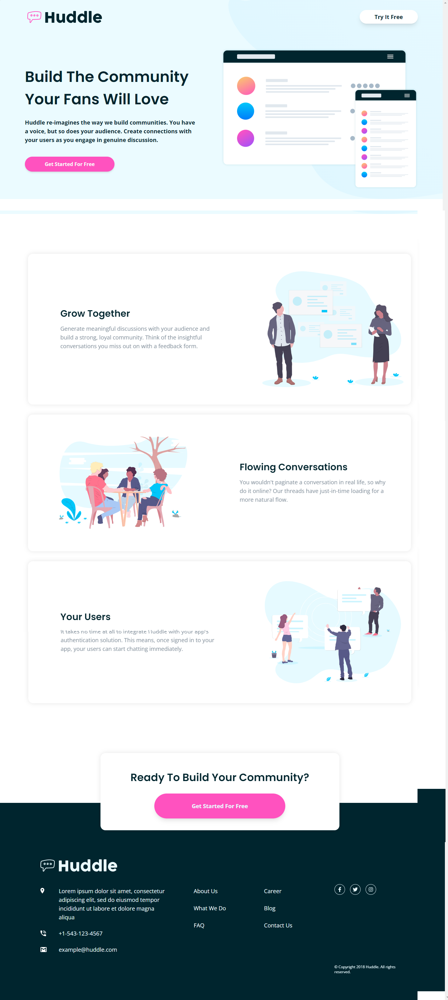
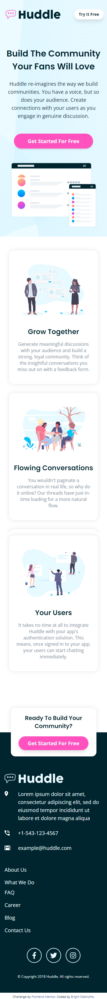

# Frontend Mentor - Huddle landing page with alternating feature blocks solution

This is a solution to the [Huddle landing page with alternating feature blocks challenge on Frontend Mentor](https://www.frontendmentor.io/challenges/huddle-landing-page-with-alternating-feature-blocks-5ca5f5981e82137ec91a5100). Frontend Mentor challenges help you improve your coding skills by building realistic projects.

## Table of contents

- [Overview](#overview)
  - [The challenge](#the-challenge)
  - [Screenshot](#screenshot)
  - [Links](#links)
- [My process](#my-process)
  - [Built with](#built-with)
  - [Continued development](#continued-development)
  - [Useful resources](#useful-resources)
- [Author](#author)

## Overview

### The challenge

Users should be able to:

- View the optimal layout for the site depending on their device's screen size
- See hover states for all interactive elements on the page

### Screenshot

### Links

- Solution URL: [Github repo](https://www.github.com/Odohofre/huddle-landing-page)
- Live Site URL: [Live Site](https://huddle-landing-page-xi-six.vercel.app/)

## My process

### Built with

- Semantic HTML5 markup
- Flexbox
- Mobile-first workflow
- [Tailwind CSS](https://www.tailwindcss.com/) - CSS framework

### Continued development

- Combine Tailwind with React

### Useful resources

- [Tailwind Official Documentation](https://www.tailwindcss.com/docs) - This helped in understanding tailwind css

## Author

- Website - [Bright Odohofre](https://odohofre.github.io)
- Frontend Mentor - [@Odohofre](https://www.frontendmentor.io/profile/Odohofre)
- Twitter - [@B_Odohofre](https://www.twitter.com/B_Odohofre)
